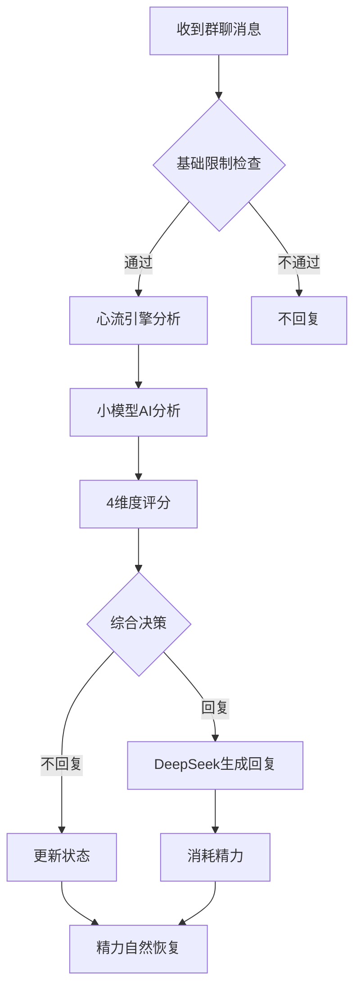

# 心流机制 (Heartflow) - 智能群聊回复系统

## 📖 概述

心流机制是一个基于**双LLM架构**的智能群聊回复决策系统，通过小参数模型快速判断是否需要回复，再使用大模型生成具体回复内容。系统模拟人类的社交精力和情绪状态，实现更自然、智能的群聊互动。

### 🌟 核心特性

- **🧠 双LLM架构**：小模型判断 + 大模型生成，兼顾效率与质量
- **⚡ 精力系统**：模拟真实社交状态，动态调节回复频率
- **🎯 智能决策**：基于4个维度的综合评分系统
- **📊 群聊隔离**：每个群聊独立的状态管理
- **🔧 灵活配置**：支持多种参数调节，适应不同群聊环境

## 🏗️ 系统架构



### 📊 评判维度

| 维度 | 权重 | 说明 |
|------|------|------|
| **内容相关度** | 30% | 消息是否有价值、有趣、适合回复 |
| **回复意愿** | 25% | 基于当前精力状态的回复意愿 |
| **社交适宜性** | 25% | 回复是否符合群聊氛围 |
| **时机恰当性** | 20% | 考虑频率控制和时间间隔 |

## ⚙️ 配置说明

### 环境变量配置

在启动前设置以下环境变量：

```bash
# ===== 必需配置 =====
SILICONFLOW_API_KEY=your_api_key_here    # 硅基流动API密钥

# ===== 核心参数 =====
HEARTFLOW_REPLY_THRESHOLD=0.6            # 回复阈值 (0-1，越高越难触发)
HEARTFLOW_ENERGY_DECAY_RATE=0.15         # 精力衰减速度 (每次回复消耗)
HEARTFLOW_ENERGY_RECOVERY_RATE=0.02      # 精力恢复速度 (每分钟)
HEARTFLOW_MIN_ENERGY_THRESHOLD=0.3       # 最低精力阈值

# ===== 频率控制 =====
HEARTFLOW_MAX_REPLIES_PER_HOUR=10        # 每小时最大回复数
HEARTFLOW_MIN_REPLY_INTERVAL=30          # 最小回复间隔(秒)
HEARTFLOW_CONTEXT_MESSAGES_COUNT=5       # 上下文消息数量

# ===== AI分析参数 =====
HEARTFLOW_API_TIMEOUT=10                 # API超时时间(秒)
HEARTFLOW_ANALYSIS_TEMPERATURE=0.3       # AI分析温度
HEARTFLOW_MAX_ANALYSIS_TOKENS=300        # 最大token数
```

### 预设配置模板

#### 🚀 活跃群聊配置
适用于活跃度高、互动频繁的群聊：

```python
from Hyperbot.plugins.Heartflow.config import get_active_config

config = get_active_config()
# 特点：回复阈值0.5，回复间隔20秒，每小时最多15次回复
```

#### 🛡️ 保守群聊配置
适用于严肃、正式的群聊环境：

```python
from Hyperbot.plugins.Heartflow.config import get_conservative_config

config = get_conservative_config()
# 特点：回复阈值0.7，回复间隔60秒，每小时最多6次回复
```

#### ⚖️ 平衡配置（推荐）
适用于大多数群聊场景：

```python
from Hyperbot.plugins.Heartflow.config import get_balanced_config

config = get_balanced_config()
# 使用默认参数，经过优化的平衡配置
```

## 🎮 使用方法

### 基本命令

用户可以在群聊中使用以下命令：

| 命令 | 功能 | 示例 |
|------|------|------|
| `心流状态` | 查看当前群聊的心流状态 | 显示精力、回复率等统计信息 |
| `群聊状态` | 同上 | - |
| `心流统计` | 同上 | - |

### 状态查看示例

```
💫 群聊心流状态报告:

🔋 当前精力: 0.75/1.0
📊 今日消息: 156 条
💬 今日回复: 12 次
📈 回复率: 7.7%
⏰上次回复: 8.5 分钟前
📝 消息缓存: 5 条
```

## 🔧 精力系统详解

### 精力机制

- **初始精力**：1.0（满精力状态）
- **精力范围**：0.1 - 1.0
- **消耗机制**：每次主动回复后精力下降
- **恢复机制**：
  - 🕐 **自然恢复**：每分钟恢复少量精力
  - 🌅 **每日重置**：每天0点额外恢复精力

### 精力状态影响

| 精力水平 | 状态 | 影响 |
|----------|------|------|
| 0.8-1.0 | 😊 充满活力 | 更容易触发回复 |
| 0.5-0.7 | 😐 普通状态 | 正常回复概率 |
| 0.3-0.4 | 😴 有些疲劳 | 回复概率降低 |
| 0.1-0.2 | 😵 精疲力尽 | 很少回复，主要休息 |

## 🚀 快速开始

### 1. 配置API密钥

```bash
export SILICONFLOW_API_KEY="your_api_key_here"
```

### 2. 启动机器人

```bash
cd Hyperbot
python -m nonebot2 run
```

### 3. 测试心流机制

在群聊中发送消息，观察机器人的回复行为：

- ✅ **触发回复的消息**：问题、求助、有趣话题
- ❌ **不易触发的消息**：简单回应、重复内容、无意义消息

## 📋 API接口

### HeartflowEngine 主要方法

```python
from Hyperbot.plugins.Heartflow import heartflow_engine

# 判断是否应该回复
should_reply, decision_info = await heartflow_engine.should_reply(
    group_id="123456789",
    user_id="987654321", 
    message="这个问题怎么解决？",
    nickname="用户A",
    persona_name="希儿"
)

# 消耗精力（回复后调用）
heartflow_engine.consume_energy("123456789")

# 获取群聊状态
stats = heartflow_engine.get_stats("123456789")
```

### 决策信息结构

```python
{
    "decision": "approved",  # approved/rejected
    "analysis": {
        "content_relevance": 8,
        "reply_willingness": 7,
        "social_appropriateness": 6,
        "timing_appropriateness": 5,
        "reasoning": "用户提出了具体问题，适合回复",
        "key_factors": ["问题导向", "合适时机"]
    },
    "final_score": 0.72,
    "threshold": 0.6,
    "energy": 0.85
}
```

## 🛠️ 故障排除

### 常见问题

#### 1. 机器人不回复任何消息

**可能原因**：
- API密钥未配置或无效
- 精力值过低
- 回复阈值设置过高

**解决方案**：
```bash
# 检查API密钥
echo $SILICONFLOW_API_KEY

# 查看心流状态
# 在群聊中发送：心流状态

# 降低回复阈值
export HEARTFLOW_REPLY_THRESHOLD=0.4
```

#### 2. 回复过于频繁

**解决方案**：
```bash
# 提高回复阈值
export HEARTFLOW_REPLY_THRESHOLD=0.7

# 增加回复间隔
export HEARTFLOW_MIN_REPLY_INTERVAL=60

# 减少每小时回复上限
export HEARTFLOW_MAX_REPLIES_PER_HOUR=5
```

#### 3. AI分析失败

**表现**：日志中出现"心流AI分析失败"

**解决方案**：
- 检查网络连接
- 验证API密钥有效性
- 增加API超时时间：`export HEARTFLOW_API_TIMEOUT=20`

### 调试模式

启用详细日志：

```python
import logging
logging.getLogger("Hyperbot.plugins.Heartflow").setLevel(logging.DEBUG)
```

## 📊 性能特点

### 响应时间

- **快速判断**：< 2秒（使用QwQ-32B模型）
- **回退策略**：< 100ms（无API调用）
- **状态查询**：< 10ms（本地计算）

### 资源使用

- **内存占用**：每个群聊约1-2KB状态数据
- **API调用**：仅在需要判断时调用，平均每天10-50次
- **存储需求**：状态数据暂存内存，重启后重置

## 🔄 更新日志

### v1.0.0 (当前版本)
- ✨ 实现双LLM架构
- ⚡ 精力系统与智能决策
- 🔧 灵活配置系统
- 📊 群聊状态监控
- 🛡️ 完善的错误处理和回退机制

## 🤝 贡献指南

欢迎提交Issues和Pull Requests！

### 开发环境设置

```bash
git clone <repository-url>
cd Hyperbot
pip install -r requirements.txt
```

### 测试

```bash
python Hyperbot/plugins/Heartflow/example.py
```

## 📄 许可证

本项目遵循 MIT 许可证。

---

> 💡 **提示**：心流机制会随着使用不断学习和优化。建议根据实际群聊环境调整配置参数，以获得最佳体验。

